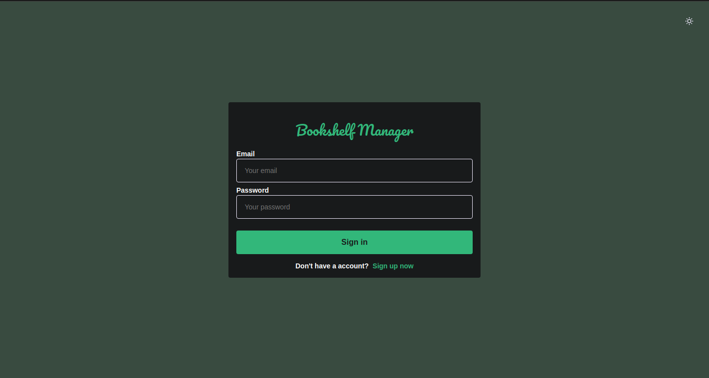
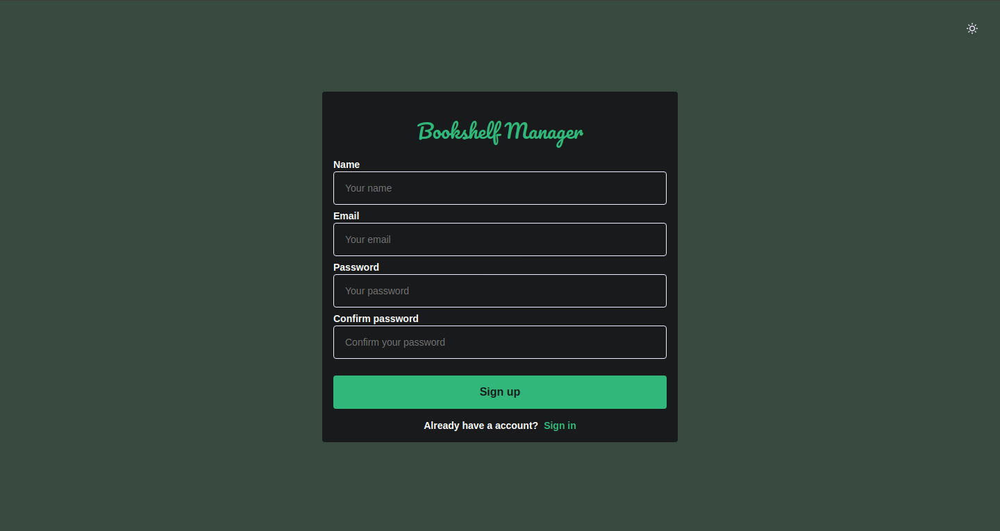
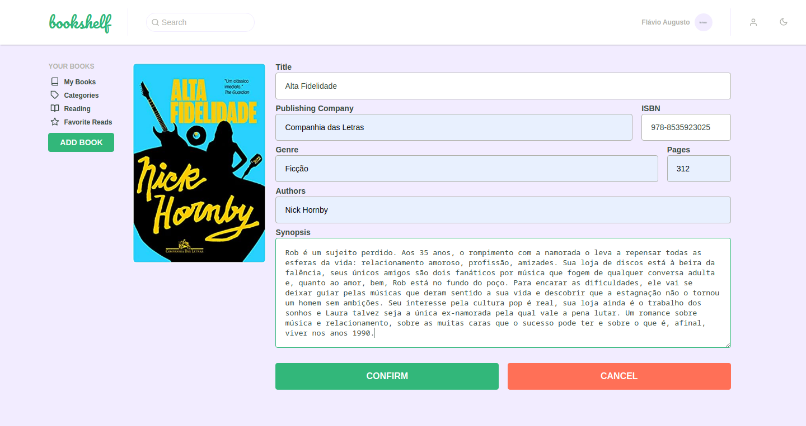
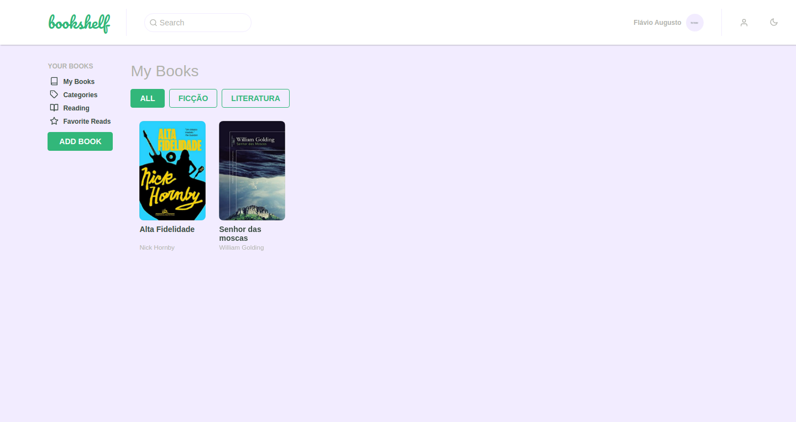
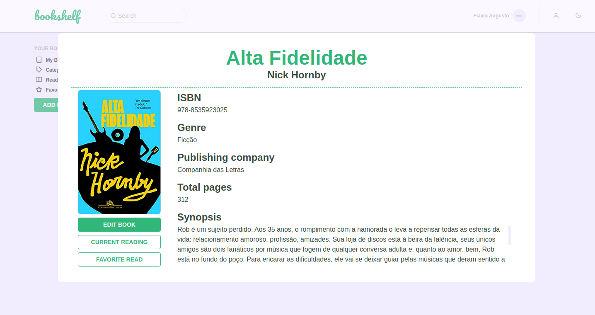
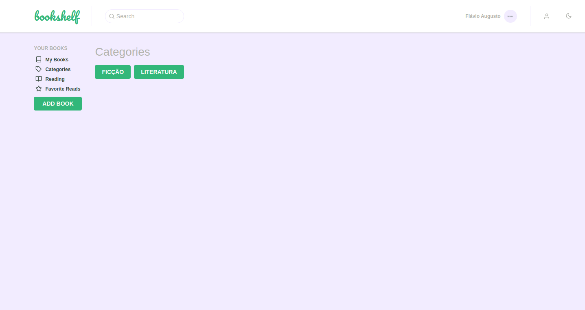

# Bookshelf-manager

<p align="center">
  
</p>

<h2 align="center">
  A virtual bookshelf. Built with ReactJS, Redux, Styled Components and Javascript.
</h2>

<p align="center">
  
  
  
  
  <a href="https://github.com/areasflavio/bookshelf-manager/commits/master">
    
  </a>
</p>

<p align="center">
  <a href="#star-features">Features</a>&nbsp;&nbsp;|&nbsp;&nbsp;
  <a href="#keyboard-technologies">Technologies</a>&nbsp;&nbsp;|&nbsp;&nbsp;
  <a href="#computer_mouse-installation">Installation</a>
</p>











<br/>

# :star: Features

[(Back to top)](#Bookshelf-manager)

This is a virtual bookshelf web application. You can create your account and start registering your books.

Some key features are:

- Functional application with ReactJS.
- Front-end state management done with Redux and Redux Saga.
- Authentication system made with JWT.
- UI built with Styled Components and React Icons.
- Light and Dark theme.
- Forms optimized and validated by Unform and Yup.
- Custom alerts with React Toastify and React Laag.
- Avatar upload for your user and your book covers.
- Type checking using PropTypes.
- List animation with Framer Motion.
- Local debugging connected with Reactotron.

The application is built using ReactJS and Redux. Data is provided by a proprietary
API, in this [repository](https://github.com/areasflavio/bookshelf-manager-server).
The user interface is built with Styled Components. The entire codebase is written
using Javascript.

<p align="center">
  Checkout the <a href="https://bookshelf-manager-server.herokuapp.com">API Live version</a>
   hosted on:
</p>
<p align="center">
    
</p>

<p align="center">
  You also can check the complete <a href="https://bookshelf-manager.vercel.app">Application Live version</a>
  hosted on:
</p>
<p align="center">
    
</p>

<br/>

# :keyboard: Technologies

[(Back to top)](#Bookshelf-manager)

This is what I used and learned with this project:

- [x] ReactJS
- [x] Redux
- [x] Redux Saga
- [x] Styled Components
- [x] React Icons
- [x] Framer Motion
- [x] Polished
- [x] JWT
- [x] Unform
- [x] Yup
- [x] React Toastify
- [x] React Laag
- [x] Immer
- [x] Axios
- [x] Eslint
- [x] Prettier
- [x] PropTypes
- [x] Javascript

<br/>

# :computer_mouse: Installation

[(Back to top)](#Bookshelf-manager)

To use this project, first you need NodeJS and the API running in your device,
then you can follow the commands below:

```bash
# Clone this repository
git clone https://github.com/areasflavio/bookshelf-manager.git

# Go into the repository
cd bookshelf-manager/web

# Install dependencies for the application
yarn install

# Copy the .env.example to the .env file and inject your credentials
cp .env.example .env

# To start the development server, run the following command
yarn start
```

# :man_technologist: Author

[(Back to top)](#Bookshelf-manager)

Build by Flávio Arêas 👋 [Get in touch!](https://www.linkedin.com/in/areasflavio/)
